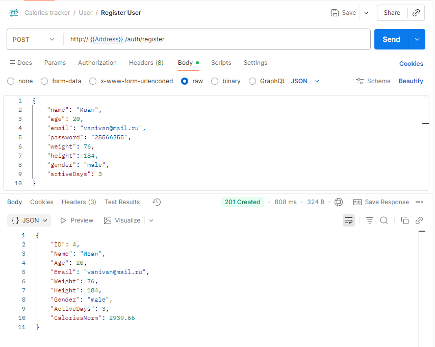
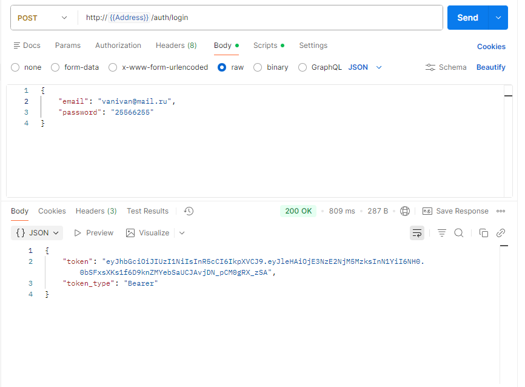

# Calorie Tracker RESTful API
A Golang RESTful API for tracking meals and calculating daily calorie intake.

The service uses **Gin** + **Gorm** with **PostgreSQL** in **Docker Compose**.

## Demonstration
<table>
  <tr>
    <td style="vertical-align: top; width: 100%;">
      
    </td>
    <td style="vertical-align: top; width: 100%;">
      
    </td>
  </tr>
  <tr>
    <td style="vertical-align: top; width: 100%;">
      
    </td>
    <td style="vertical-align: top; width: 100%;">
      
    </td>
  </tr>
  <tr>
    <td style="vertical-align: top;" colspan="2">
      
    </td>
  </tr>
</table>

## Installation & Run
### Prerequisites
1. [Go (1.20+)](https://go.dev/doc/install)
2. [Docker & Docker Compose](https://docs.docker.com/engine/install/)

### Clone repository
```bash
git clone https://github.com/sustatov027-max/project_calorie_tracker.git
cd project_calorie_tracker
```

### Configuration
Create `.env` in project root:

```env
POSTGRES_USER=your_user
POSTGRES_PASSWORD=your_password
POSTGRES_DB=tracker_calories
DB_HOST=pg
DB_PORT=5432
COST=14
SECRET=your_jwt_secret
PORT=8080
```

### Quick Start (Development)
1. Start PostgreSQL:
   ```bash
   make db-up
   ```
2. Start app:
   ```bash
   make dev
   ```

### Available Commands
- `make dev` - start database and application
- `make db-up` - start only PostgreSQL
- `make db-down` - stop containers
- `make test` - run Go tests

### API Endpoint
`http://localhost:8080`

## Structure
```text
project_calorie_tracker/
├── cmd/
│   └── main.go
├── internal/
│   ├── handlers/
│   │   ├── diary_handler.go
│   │   ├── product_handler.go
│   │   ├── product_handler_test.go
│   │   ├── user_handler.go
│   │   ├── user_handler_test.go
│   │   └── mock/
│   │       ├── mock_product_services.go
│   │       └── mock_user_services.go
│   ├── middlewares/
│   │   └── authMiddleware.go
│   ├── models/
│   │   ├── daySummary.go
│   │   ├── mealLog.go
│   │   ├── product.go
│   │   └── user.go
│   ├── repositories/
│   │   ├── diary_repository.go
│   │   ├── product_repository.go
│   │   └── user_repository.go
│   ├── services/
│   │   ├── diary_service.go
│   │   ├── product_service.go
│   │   └── user_service.go
│   └── validation/
│       └── validator.go
├── pkg/
│   ├── database/
│   │   └── db.go
│   └── utils/
│       ├── context.go
│       └── hashPassword.go
├── docker-compose.yaml
├── Dockerfile
├── Makefile
└── README.md
```

## API
### Authentication
- `POST /auth/register` - register user
- `POST /auth/login` - login user

### User Profile
- `GET /me` - get current user profile (auth required)

### Food Diary
- `GET /diary` - get meals for current day (auth required)
- `POST /diary` - add meal (auth required)
- `PUT /diary/:id` - update meal (auth required)
- `DELETE /diary/:id` - delete meal (auth required)
- `GET /diary/summary` - daily summary (auth required)

### Products
- `GET /products` - list products (auth required)
- `POST /products` - create product (auth required)
- `PUT /products/:id` - update product (auth required)
- `DELETE /products/:id` - delete product (auth required)

> All endpoints except `/auth/*` require `Authorization: Bearer <token>`.

## Example requests
1. Register user
```bash
curl -X POST http://localhost:8080/auth/register \
  -H "Content-Type: application/json" \
  -d '{"name":"Test","age":19,"email":"test@mail.ru","password":"12345678","weight":76,"height":184,"gender":"male","activeDays":3}'
```
Response:
```json
{
  "ID": 1,
  "Name": "Test",
  "Age": 19,
  "Email": "test@mail.ru",
  "Weight": 76,
  "Height": 184,
  "Gender": "male",
  "ActiveDays": 3,
  "CaloriesNorm": 2950.16
}
```

2. Login user
```bash
curl -X POST http://localhost:8080/auth/login \
  -H "Content-Type: application/json" \
  -d '{"email":"test@mail.ru","password":"12345678"}'
```
Response:
```json
{
  "token": "mock-jwt-token-12345",
  "token_type": "Bearer"
}
```

3. Add meal to diary
```bash
curl -X POST http://localhost:8080/diary \
  -H "Authorization: Bearer <token>" \
  -H "Content-Type: application/json" \
  -d '{"product_id":123,"grams":100}'
```
Response:
```json
{
  "id": 1,
  "user_id": 1,
  "product_id": 123,
  "product": {
    "ID": 123,
    "Name": "Avocado",
    "Calories": 160,
    "Proteins": 2,
    "Fats": 15,
    "Carbohydrates": 9,
    "CreatedAt": "2024-01-22T15:00:00Z"
  },
  "grams": 100,
  "created_at": "2024-01-22T13:45:00Z"
}
```

4. Get daily summary
```bash
curl -X GET http://localhost:8080/diary/summary \
  -H "Authorization: Bearer <token>"
```
Response:
```json
{
  "meals": [],
  "total_calories": 1850,
  "total_proteins": 83,
  "total_fats": 57,
  "total_carbs": 188,
  "daily_norm": 2100,
  "remaining": 250
}
```
